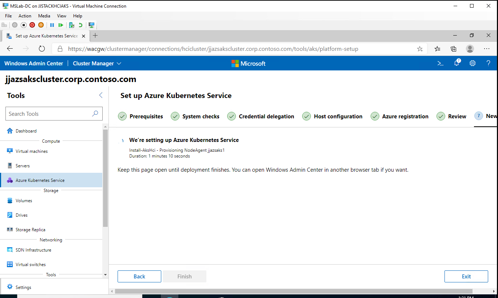
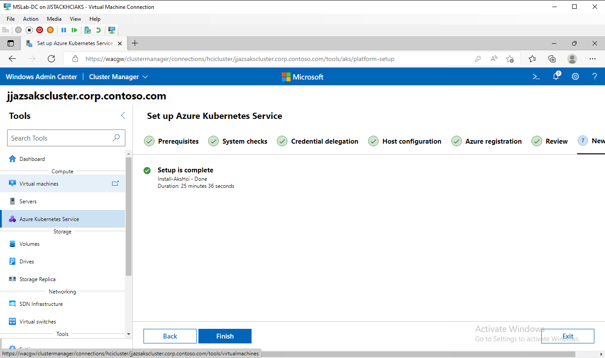
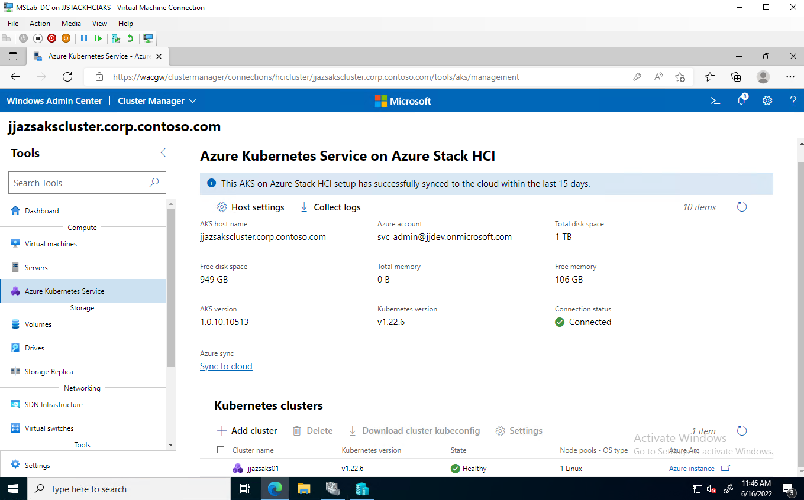
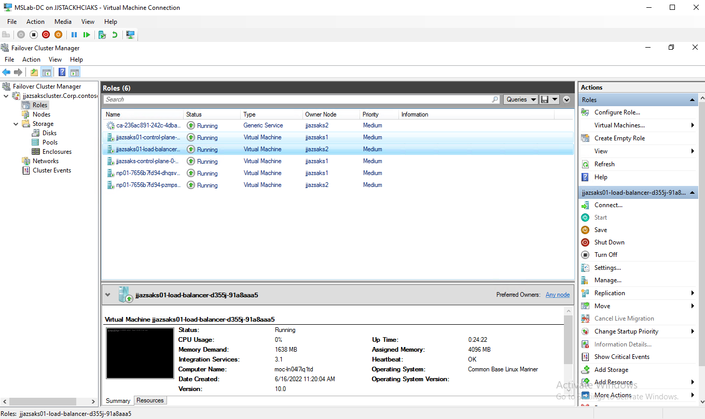
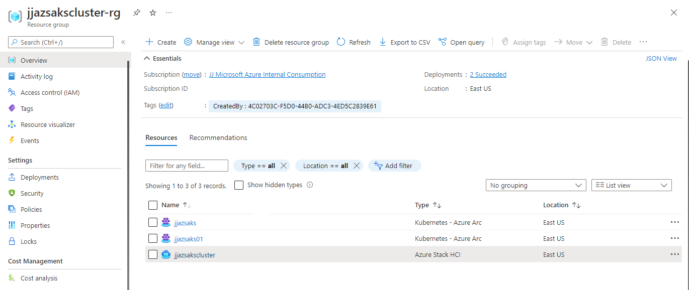

# AzureStack HCI deployment

## Deploy basic infrastructure

How to create Lab
- https://docs.microsoft.com/en-us/azure-stack/hci/deploy/tutorial-private-forest
- https://github.com/microsoft/MSLab/tree/master/Scenarios/AzSHCI%20and%20Cluster%20Creation%20Extension

Create virtual machine
- sizing: Standard E16bds v5
- disk: Premium SSD LRS 512 GB
- run prepare scripts from MSLab

Run LabConfig.ps1 under administrator rights
- find LabConfig, copy and run on Hyper-V virtual machine
- run 3_Deploy.ps1
- install Windows Admin Center 
    - https://github.com/microsoft/MSLab/tree/master/Scenarios/AzSHCI%20and%20Cluster%20Creation%20Extension#install-windows-admin-center-in-gw-mode
    - https://docs.microsoft.com/en-us/windows-server/manage/windows-admin-center/deploy/install#install-on-server-core

Register Windows Admin Center
- https://docs.microsoft.com/en-us/azure-stack/hci/manage/register-windows-admin-center
- login https://wacgw/

## Deploy AzureStack HCI cluster with Azure Kubernetes Service

Lab scripts
- https://github.com/microsoft/MSLab/tree/master/Scenarios/AzSHCI%20and%20Kubernetes

Steps in script
- create HCI cluster
- register HCI in Azure

Logon into DC virtual machine 
- run script Scenario.ps1 - step by step run regions under administrator rights
- test to connect jjazsakscluster
- VMs running in 10.0.0.0/24 (installed DHCP server with scope 10.0.0.0/24)

Next go to create AKS cluster (connect to cluster and using Windows Admin Center)
- create cluster storage AKS 1 TB
- make sure VM have available cores and 30 GB RAM
- create AKS (aks management)
    - IP allocation - Static (subnet 10.0.0.0/24, gw 10.0.0.1, dns 10.0.0.1)
    - Kubernetes nodepool - from 10.0.0.101 to 10.0.0.254
    - Virtual IP pool - from 10.0.0.50 to 10.0.0.100
- create AKS cluster (aks workload)
    - define loadbalancer, nodepool sizing and networking options

