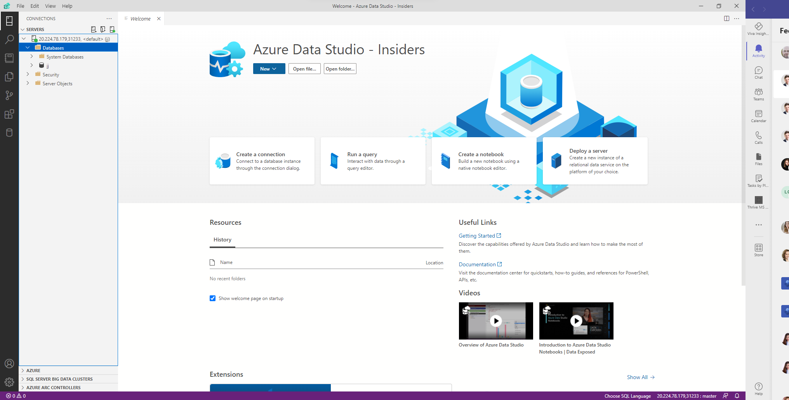

# Deploy Rancher K3s with Azure Arc and Azure Services

## Deploy K3s with Azure Arc for kubernetes

Docs
- Jumpstart https://azurearcjumpstart.io/azure_arc_jumpstart/azure_arc_k8s/rancher_k3s/azure_arm_template/

Create VM

```powershell
$rg = "jjrancher-rg"
$myip=$(curl -4 ifconfig.io)
az group create -n $rg -l westeurope

az network nsg create -g $rg -n jjrancher-nsg
az network nsg rule create -g $rg `
    --nsg-name jjrancher-nsg `
    -n ssh `
    --priority 150 `
    --source-address-prefixes $myip/32 `
    --destination-port-ranges 22 `
    --protocol Tcp `
    --description ssh
az vm create -n jjrancher -g $rg --image UbuntuLTS `
    --size Standard_B2ms --authentication-type password --admin-username jj `
    --nsg jjrancher-nsg --public-ip-address jjrancher-ip --storage-sku StandardSSD_LRS 
```

Install K3s and connect to Azure Arc

```sh
# Install K3s without Traefik
curl -sfL https://get.k3s.io | sh -s - --disable=traefik

# Install Azure CLI and extensions
curl -sL https://aka.ms/InstallAzureCLIDeb | sudo bash
az extension add --upgrade --yes --name connectedk8s
az extension add --upgrade --yes --name k8s-extension
az extension add --upgrade --yes --name customlocation
az extension add --upgrade --yes --name appservice-kube

# login using existing Service principal jjrancherk3s
az login --tenant jjdev.onmicrosoft.com --service-principal -u 30b63f8d-eb8d-4618-9bd6-1e0b548bb8ca -p <SECRET>

mkdir .kube
sudo cp /etc/rancher/k3s/k3s.yaml ~/.kube/config
sudo chown jj:jj ~/.kube
sudo chown jj:jj ~/.kube/config
export KUBECONFIG=~/.kube/config

# connect using Custom Locations RP
export oid=$(az ad sp show --id 'bc313c14-388c-4e7d-a58e-70017303ee3b' --query objectId -o tsv)
az connectedk8s connect -g jjrancher-rg -n jjrancher --custom-locations-oid $oid
az connectedk8s show -g jjrancher-rg -n jjrancher --query provisioningState   # Should show Succeeded
```

Now you will see Azure Arc for Kubernetes resource for jjrancher in Azure Portal.

### Configure Cluster Connect

Docs
- https://docs.microsoft.com/en-us/azure/azure-arc/kubernetes/cluster-connect#service-account-token-authentication-option

Connect to K8s cluster

```bash
kubectl create serviceaccount admin-user
kubectl create clusterrolebinding admin-user-binding --clusterrole cluster-admin --serviceaccount default:admin-user
SECRET_NAME=$(kubectl get serviceaccount admin-user -o jsonpath='{$.secrets[0].name}')
TOKEN=$(kubectl get secret ${SECRET_NAME} -o jsonpath='{$.data.token}' | base64 -d | sed $'s/$/\\\n/g')
echo $TOKEN
```

Copy token and past into Azure portal in Kubernetes resources blades.

## Deploy App Service extension

Docs
- App Services https://docs.microsoft.com/en-us/Azure/app-service/manage-create-arc-environment

Custom location docs https://docs.microsoft.com/en-us/azure/azure-arc/kubernetes/conceptual-custom-locations

Next go to Azure Portal and add new *Application Services* extension to *Kubernetes - Azure Arc*
- instance name - jjrancherapps
- new custom location - jjrancherloc
- static IP - VM public ip
- storage class - local-path
- And copy script and run it 

Now you can see Custom location jjrancherloc and App Service Kubernetes Environment resource using this custom location.

Next add NSG rule to allow communication for web

```powershell
$rg = "jjrancher-rg"
az network nsg rule create -g $rg `
    --nsg-name jjrancher-nsg `
    -n web `
    --priority 160 `
    --source-address-prefixes * `
    --destination-port-ranges 443 `
    --protocol Tcp
```

Now you can deploy Azure Functions / Web App into Region jjrancherloc.

## Deploy API Management gateway extension

Docs
- https://docs.microsoft.com/en-us/azure/api-management/how-to-deploy-self-hosted-gateway-azure-arc

Create new API management service first.

Next go to Azure Portal and add new *API Management gateway* extension to *Kubernetes - Azure Arc*
- select resource group with provisioned API Management service
- new Gateway name - jjrancherapi
- namespace - jjrancher
- service type - LoadBalancer
- ports - default (http 8080, https 8081)

Now you can check API Management gateways to see Selfhosted gateway is up-to-running. Next assign API (e.g. Echo API) to this gateway. Check API design blade which Gateways are associated.

## Deploy Data controller extension

Docs
- Jumpstart https://azurearcjumpstart.io/azure_arc_jumpstart/azure_arc_data/microk8s/
- Connectivity mode https://docs.microsoft.com/en-us/azure/azure-arc/data/connectivity

Next go to Azure Portal and add new *Azure Arc data controller* extension to *Kubernetes - Azure Arc*
- data controller name - jjrancherdata
- new custom location - jjrancherloc
- kubernetes - configuration template - azure-arc-kubeadm
- kubernetes - infrastructure - azure
- kubernetes storage class - local-path

```powershell
sudo kubectl get crd | grep arcdata
```


Resize Rancher host to enough resources B20ms and SSD Premium disk.

Now you can create database server
- MSSQL Managed instance https://docs.microsoft.com/en-us/azure/azure-arc/data/create-sql-managed-instance

Database needs ReadWriteMany storage class for backups - check docs https://docs.microsoft.com/en-us/azure/azure-arc/data/storage-configuration

We will use temporary solution (NFS running on host) https://itnext.io/kubernetes-storage-part-1-nfs-complete-tutorial-75e6ac2a1f77

```bash
sudo apt-get update
sudo apt-get install nfs-common nfs-kernel-server -y
sudo mkdir -p /data/nfs1
sudo chown nobody:nogroup /data/nfs1
sudo chmod g+rwxs /data/nfs1
echo -e "/data/nfs1\t10.0.0.0/8(rw,sync,no_subtree_check,no_root_squash)" | sudo tee -a /etc/exports
sudo exportfs -av 
# restart and show logs
sudo systemctl restart nfs-kernel-server
sudo systemctl status nfs-kernel-server
sudo apt install nfs-common -y
```
Now install Storage Class

```bash
curl https://raw.githubusercontent.com/helm/helm/main/scripts/get-helm-3 | bash

helm repo add nfs-subdir-external-provisioner https://kubernetes-sigs.github.io/nfs-subdir-external-provisioner
helm install nfs-subdir-external-provisioner nfs-subdir-external-provisioner/nfs-subdir-external-provisioner \
  --create-namespace \
  --namespace nfs-provisioner \
  --set nfs.server=10.0.0.4 \
  --set nfs.path=/data/nfs1
```
Now you can use Storage Class named: nfs-client

Create MSSQL MI server with Az CLI (max 15 characters)

```powershell
$rg = "jjrancher-rg"
az sql mi-arc create `
    --name jjranchersql --resource-group $rg --location westeurope `
    -–subscription xxxxxxxx-xxxx-xxxx-xxxx-xxxxxxxxxxxx `
    --custom-location jjrancherloc --storage-class-backups nfs-client
```


Install Azure Data Studio https://github.com/microsoft/azuredatastudio#try-out-the-latest-insiders-build-from-main

Install SqlCmd https://docs.microsoft.com/en-us/sql/linux/sql-server-linux-setup-tools?view=sql-server-ver15#ubuntu

Connect https://docs.microsoft.com/en-us/azure/azure-arc/data/connect-managed-instance

```powershell
$rg = "jjrancher-rg"
az network nsg rule create -g $rg `
    --nsg-name jjrancher-nsg `
    -n sql `
    --priority 170 `
    --source-address-prefixes * `
    --destination-port-ranges 31233 `
    --protocol Tcp
```

```bash
/opt/mssql-tools/bin/sqlcmd -S 10.0.0.4,31233 -U jj
```


